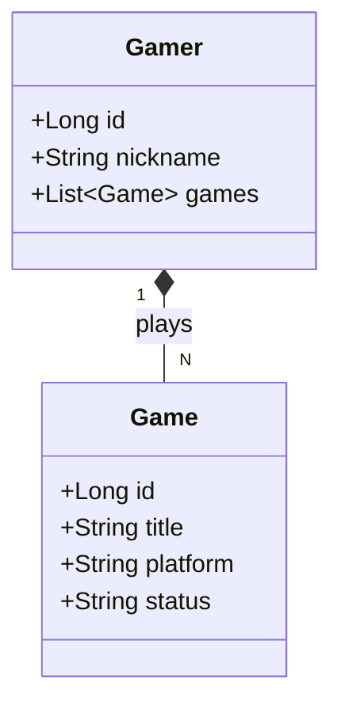

# GamerMatch-API---RESTful-API-com-Spring-Boot-3
API REST desarrollada para el desafío de DIO 'Santander Dev Week 2023'

API REST. El proyecto se enfoca en la gestión de jugadores y sus catálogos de juegos, aplicando buenas prácticas de desarrollo.

Tecnologías:

Java 17 & Spring Boot 3

Spring Data JPA & PostgreSQL

OpenAPI (Swagger) para documentación

Despliegue en la nube (Railway/Render)
